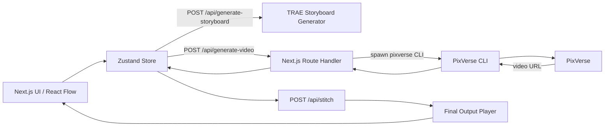

# VibeCine (PixVerse Track MVP)

> Hackathon submission summary table: [PROJECT_INFORMATION.md](./PROJECT_INFORMATION.md)

VibeCine is a hackathon MVP that helps users turn a story idea into a short video by generating a storyboard (shots) and generating one PixVerse clip per shot, inside a workspace-style visual flow UI (React Flow).

The key idea is to treat each node as a shot (not a single frame). This makes the workflow regeneration-friendly: if shot 3 is bad, regenerate shot 3 only, keep the rest.

Target demo requirement: final story duration >= 30 seconds (for example 4 shots x 10 seconds).

## Demo Video

### YouTube

**[Watch on YouTube](https://www.youtube.com/watch?v=2rFcfjQH7PM)**

[](https://www.youtube.com/watch?v=2rFcfjQH7PM)

## Creative Concept / Problem Statement

In text-to-video hackathon demos, the biggest pain points are:

- The output feels disjointed between shots
- The character identity drifts (face/outfit/lighting)
- A single long prompt is harder to control and harder to regenerate partially

VibeCine solves this with a clear, judge-friendly workflow:

1) Upload a character reference image (identity anchor)
2) Enter a story prompt
3) TRAE generates a storyboard (3-5 shots for MVP)
4) User edits each shot prompt
5) Generate a clip per shot with PixVerse (CLI or API)
6) Play the final story as sequential clips in a single player

## Workflow (End to End)

### Step 1. Inputs

- Character reference image: the main character identity anchor
- Story prompt: high-level premise, tone, and visual style

### Step 2. Storyboard (TRAE)

TRAE generates a shot list. Each shot contains:

- title
- scene description
- video prompt (editable)

### Step 3. Edit Shots

Each shot is editable in-place (Scene node cards). This is the “human-in-the-loop” step for quality control.

### Step 4. Generate Clips (PixVerse)

- Per-shot: click “Submit to PixVerse” to generate that shot only
- Batch: click “Generate all videos” to generate all shots

Continuity trick:

- For shot N, we prepend shot N-1 metadata (title/description/prompt) into shot N’s prompt string.
- This increases character consistency and reduces “disjointed” transitions without changing the underlying generation call structure.

### Step 5. Final Output (>= 30s)

- Click **Combine final video** on the Final Output node to merge completed clips (server-side ffmpeg).
- Preview and download the combined MP4 in the same node.
- Shot duration is tuned so a 3–5 shot storyboard can reach **>= 30s** total.

## Architecture (Diagram)



## TRAE Usage Highlights (What We Show)

- Story prompt -> storyboard generation (3-5 shots)
- Prompt refinement per shot (camera/motion/lighting)
- Continuity chaining by injecting previous shot context into the next shot prompt
- Clear iteration loop: edit -> regenerate shot -> review

## PixVerse Usage Highlights

### PixVerse CLI (recommended for hackathon)

CLI is great for hackathons because it outputs structured JSON and is easy to script. Example commands from PixVerse documentation:

```bash
pixverse auth login
pixverse auth status --json
```

Text-to-video:

```bash
pixverse create video --prompt "A sunset over ocean waves" --model v6 --quality 1080p --aspect-ratio 16:9 --duration 8 --audio --json
```

Image-to-video:

```bash
pixverse create video --prompt "Slow zoom in, cinematic lighting" --image ./character.png --duration 10 --json
```

### PixVerse Platform API (optional)

API workflow is: upload image -> generate -> poll status -> get URL. In this MVP we primarily focus on CLI for speed.

## Hackathon Issues We Hit (and Fixes)

These are real issues we encountered while building the MVP:

1) Next.js runtime error: createContext only works in Client Components
   - Fix: move providers (HeroUIProvider) into a dedicated client Providers component.

2) PixVerse API error: Insufficient balance / top up credits
   - Cause: API credits are separate and can be empty.
   - Fix: switch to CLI account credits or top up.

3) Windows process error: spawn EINVAL
   - Cause: spawning a .cmd shim directly can fail depending on environment.
   - Fix: run PixVerse through cmd.exe or spawn the underlying command correctly.

4) CLI parsing error: PixVerse CLI did not return JSON
   - Cause: CLI may print JSON with extra logs/progress or use stderr.
   - Fix: robust JSON extraction from mixed output (strip ANSI, detect JSON blocks).

## Tech Stack

- Next.js 15 (App Router)
- React 19
- TypeScript
- TailwindCSS
- HeroUI v2
- React Flow
- Zustand
- No database, no auth, no external backend

## Local Setup

### Requirements

- Node.js 20+
- PixVerse CLI installed and authenticated

```bash
npm install -g pixverse
pixverse auth login
```

### Run

```bash
npm install
npm run dev
```

Open: http://localhost:3000

## Demo Script (Fast)

1) Upload a character reference image
2) Paste a story prompt
3) Click “Generate storyboard”
4) Edit shot prompts (optional)
5) Click “Generate all videos”
6) Click **Combine final video** to merge clips and preview the full story (30s+)

## Key Files

- Flow UI: `src/app/page.tsx`
- State store: `src/store/useAppStore.ts`
- Shot node UI: `src/components/SceneNode.tsx`
- Final output player: `src/components/OutputNode.tsx`
- Generate route: `src/app/api/generate-video/route.ts`
